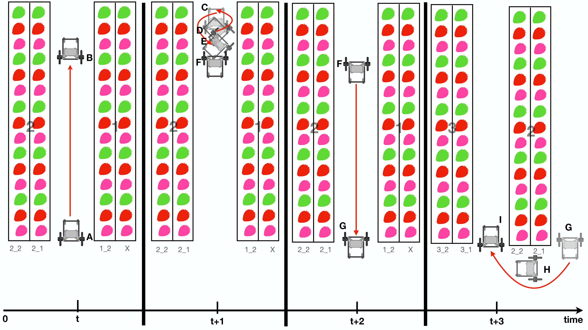

# Ginzafarm Fukaya Local 5G Robot

This project has three main components which are the role of Attraclab responsibility.

1. Autonomous driving program

2. Photo capturing by GoPro

3. Photo trasferring to local Edge Server

There are two greenhouses as A_house and C_house, the code of each house is identical, but the parameter files are different.

## Software dependencies
- [jmoab-ros](https://github.com/rasheeddo/jmoab-ros)
- [ydlidar_ros_driver](https://github.com/YDLIDAR/ydlidar_ros_driver)
- `sudo pip3 install pathlib requests netifaces datetime simple-pid pyyaml`

## FARBOT System Architecture

Jetson Nano 4GB is the main computer on the robot. AT_JMOAB06 is used as an interface board to control motors, to get signal from radio receiver (Futaba Rx), and to passthrough I2C communication for other I2C device such as BNO055 (IMU). YDLidar TG30 is a 360 2D laser scanner is used as distance sensor measurement unit. GoPro HERO 10 is a candidate camera because there is a stabilization implemented and able to achieve 4K resolution of image quality.


As the picture above, `jmoab-ros` package is used to control cart from `atcart_basic.py`, and to get IMU data from `bno055.py`. The available ROS topics could be seen under `/jmoab/...` . YDLidar has `TG.launch` file to start TG30 lidar and we can get `/scan` topic.

There are two main nodes from this project which is 

1. `greenhouse_navigation2.py`, this node is taking care of autonomous driving algorithms and send `cmd_vel` back to `atcart_basic` to move the cart.

2. `gopro_capture_udp.py`, this node is taking care of GoPro HERO 10 interface. The shutter will be pressed programmatically according to UDP data packet from `greenhouse_navigation2` , the captured image will be sent by to Ginzafarm Edge Serer over WiFi by `rsync` command.

## Autnomouse Driving Algorithms

There are three behaviors as following,  

- wall-following
- u-turn at end lane
- lane-changing at lane entrance

which robot will perform depends on the laserscan data and the `shelf_no` and `shelf_no_nav`. Below is a diagram of greenhouse and robot starting and finished point.


Robot will start from red dot where it is `shelf_no = 1` and `shelf_no_nav = 2`. `shelf_no` means the strawberry shelf where the robot's camera is pointing to during navigation. So our camera is on right side of the robot and it's pointing to shelf number 1, `shelf_no_nav` means the direction of navigation which can be

1 : going from lane end back to starting point
2 : goint from starting point to lane end.

So as starting point location, the strawberry shelf which robot going to take a photo is called 1_2, it comes from `shelf_no` _ `shelf_no_nav` numbers.

The robot will move from right side to left side of greenhouse and stop at blue end point on picture above.

### Motion Explanation

Let focus on first two lanes at starting point, please look on the picture below and read with the following description.



At time `t`, the robot starts to move at point `A` by using wall-following behavior. It will keep a distance between the strawberry shelf as specified in `custom_params.py`. During this motion, GoPro will take a photo of right side strawberry shelf, and name it as `1_2_1`, `1_2_2`, `1_2_3`, and so on until tht end. The wall-following motion will be ended at point `B` because it could detect a wall in front of it. And GoPro will stop taking photo.

At time `t+1`, robot starts to perform u-turning behavior, which orientation will be changed to 180 degrees the motion starts from `C` to `D` to `E` then at `F` the robot should be facing out to come back to starting point again.

At time `t+2`, robot starts from point `F` and now `shelf_no` is 2 and `shelf_no_nav` is 1. From point `F` to `G` it will use wall-following behavior again, and GoPro will take a photo with naming as `2_1_1`, `2_1_2`, `2_1_3` and so on until the end. When it arrived at point `G` GoPro will stop taking photo.

At time `t+3`, robot starts to perform lane-changing behavior which will move itself from `G` to `H` and finally stop at `I`. Now the robot will start taking photo again with `shelf_no` 2 and `shelf_no_nav` 2, and the navigation behavior will return to wall-following simlar to time `t` again.

These motion will be done repeatedly until it finished one chosen block. One block is thought as 6 strawberry shelf.

### Motion Parameters

Each behavior is using different laserscan angles range. Let's take a look first on how we take lidar laserscan data.


The wall-following behavior uses the laserscsan angle as 70 to 80 degrees on left side, and -80 to -70 degrees on right side. To decide when to use left or right wall-following, it depends on the strawberry shelf, but generally it will start with right wall-following. We take the closest point in the angle ranges, and uses that as input PID control for wall-following. The angle ranges parameters are as `right_wf_min_scan_ang` to `right_wf_max_scan_ang` and `left_wf_min_scan_ang` to `left_wf_max_scan_ang`. The PID parameters are as `wf_p`, `wf_i` and `wf_d`.


The robot will stop and lane end by checking on `front_stop_dist`, ths distance is smallest value between the range from `front_min_scan_ang` to `front_max_scan_ang`. That is how it can know whether there is front wall or not.

The u-turning motion doesn't use laserscan to do anything, but with IMU data to know its orientation.

After performing wall-following once more to come back to open end again, it is using `right_lct_dist` distance to detect whether it arrived at lane entrance or not. This distance is the smallest value from the angle range of `right_lct_min_scan_ang` to `right_lct_max_scan_ang`, it's called as right lane-changing trigger distance.

Then the lane-changing is using a smallest distance between `right_lc_min_scan_ang` and `right_lc_max_scan_ang`, the sequence of motion will be explained with image below,


it goes straight from point `a` until the the smallest value of `right_lc_dist` is more than `lc_dist_step1` parameters, then it will turn 90 degrees at point `b`, and continue going straigh to `c`. During going straight if `right_lc_dist` is more than `lc_dist_step2` then it will turn 90 degrees again at point `d`, and finally stop at point `e`. The parameters of `lc_dist_step1` and `lc_dist_step2` depend on the lane in each house, so from experiment we make a custom array of this parameter in `custom_params.py`

The laserscan angle range parameters which explained above are specified in `GreenhouseNavParams.yaml`.

## Parameters files

The `greenhouse_navigation2.py` is using two parameters file,

- `GreenhouseNavParams.yaml`, velocities, laserscan ranges, PID gain are stored in here
- `custom_params.py`, these parameters are custome according to A_house or C_house

  - `wf_decision_list` is the list of decision to use right or left wall-following `True` is right, `False` is left. The array element (tuple) and shelf number are related as [(1_1, 1_2), (2_1, 2_2), (3_1, 3_2), ... , (30_1, 30_2) ].
  - `wf_setpoint_list` is the set point of PID `wall_following`, meaning it will keep the distance as specified.
  - `lc_dist_step1_list` is the list of `lc_dist_step1` in lane-changing behavior.
  - `lc_dist_step2_list` is the list of `lc_dist_step2` in lane-changing behavior.
  - `shelf_number` and `shelf_number_nav` always be fixed as 1 and 2. In debugging step, we can force this to something else to avoid starting from beginning every times, it could save us some time.
  - `house` is the house name, just only `A` or `C` is accepted.

- The `gopro_capture_udp.py` is using `camera_params.py` as parameters file.
  - `frames_require_list` is number of picture we need in each lane
  - `capture_time_list` is an estimated delay time to pause before taking next photo, please check on `speed_note.txt` for more detail of calculation.
  - `gopro_ip` is the IP of GoPro, we need to check this first by `ifconfig`. The Jetson IP will be something like `172.2x.xxx.52`, then the GoPro IP is `172.2x.xxx.51` as default.
  - `server_user` is a username of edge server
  - `server_ip` is an IP address of edge server
  - `server_dest` is the destination path on edge server for image transfer. 

## Run

Each node is started by systemd from service file, you can check on `autostart_scripts` directory.

- ros_roscore.service
- ros_atcart.service
- ros_bno055.service
- ros_ydlidar.service
- ros_greenhouse_nav.service
- ros_gopro.service

you can control the service file by these following commands,

```sh
## replace <node-name> to the name of program you want to check

## check the status of service, active, dead, or failure.
sudo systemctl status ros_<node-name>.service

## stop the service, this will stop all of bash script and python script which related
sudo systemctl stop ros_<node-name>.service

## start the service
sudo systemctl start ros_<node-name>.service

## if don't want to autostart next reboot
sudo systemctl disable ros_<node-name>.service

## if want to autostart next reboot
sudo systemctl enable ros_<node-name>.service

```

Each of service file will run separate bash script as,

- start_roscore.sh
- start_atcart.sh
- start_bno055.sh
- start_ydlidar.sh
- start_greenhouse_navigation.sh
- start_gopro.sh

during runtime, you can check the printing state of each node from log file

```sh
tail -f <node-name>.log
```

In case you have updated something in code or in parameters file, you can restart the node by systemctl command (stop -> start) or searching the running process and kill with process id number.

```sh
## 1. Restart with systemctl
sudo systemctl stop ros_<node-name>.service
## then wait a second and 
sudo systemctl start ros_<node-name>.service

## OR 

## 2. search and kill the process
ps ax | grep <node-name>
## look on the pid number of node we want to kill
kill -9 <pid-number>
```